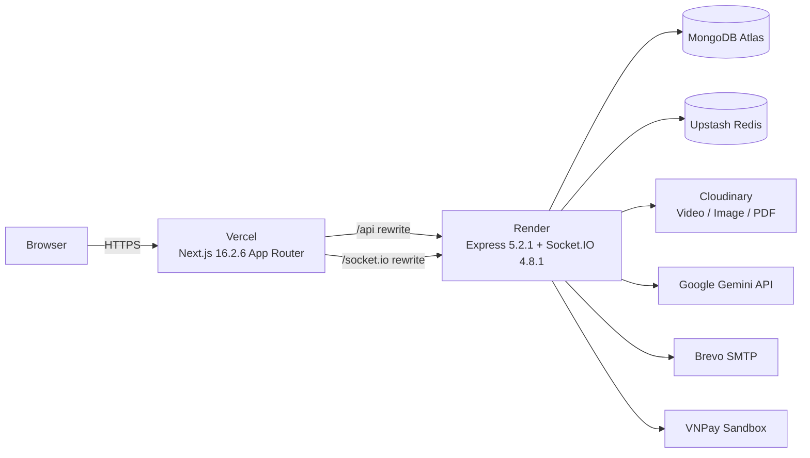

# Edunest — Nền Tảng Học Tiếng Anh Trực Tuyến

<div align="center">


**Edunest** là nền tảng học tiếng Anh trực tuyến theo mô hình MOOC, lấy cảm hứng từ Udemy. Hệ thống hỗ trợ hai vai trò trong RBAC: **người dùng (user)** và **quản trị viên (admin)**. Mọi tài khoản đã đăng ký đều có thể tạo và quản lý khóa học; admin chịu trách nhiệm duyệt nội dung và vận hành hệ thống.

> **Kiến trúc:** Dự án tách thành hai tiến trình độc lập — `frontend` (Next.js 16.2.6 App Router) và `backend` (Express 5.2.1 + Socket.IO 4.8.1). Giao tiếp qua HTTPS và JWT, dữ liệu lưu trong MongoDB, cache/queue dùng Redis. Frontend proxy `/api` và `/socket.io` sang backend qua cơ chế rewrite của Next.js, giúp cookie đăng nhập gắn theo domain frontend.

[Demo](#demo) · [Tính năng](#tính-năng) · [Kiến trúc](#kiến-trúc) · [Cài đặt](#cài-đặt) · [API Docs](#api-documentation) · [Deployment](#deployment)

</div>

---

## Demo

| Dịch vụ | URL |
|---------|-----|
| **Frontend** | [edunest-frontend-kappa.vercel.app](https://edunest-frontend-kappa.vercel.app/) |
| **Backend API** | [edunest-backend-ytfb.onrender.com](https://edunest-backend-ytfb.onrender.com) |
| **Swagger UI** | [/api-docs](https://edunest-backend-ytfb.onrender.com/api-docs) |
| **Health Check** | [/api/health](https://edunest-backend-ytfb.onrender.com/api/health) |

> **Lưu ý:** Cookie đăng nhập (`edunest_access_token`, `edunest_refresh_token`) được backend set với `SameSite=Lax; Secure`, do đó sẽ đi kèm request từ domain frontend trên Vercel. Khi chạy local, xem hướng dẫn tại mục [Cài đặt](#cài-đặt) và [Tài khoản demo](#tài-khoản-demo).

---

## Tính năng

### Học viên

- [x] Đăng ký / Đăng nhập bằng email + mật khẩu (JWT + Refresh Token, HTTP-only cookie)
- [x] Xác minh email, quên mật khẩu, đổi mật khẩu, quản lý phiên đăng nhập
- [x] Đăng nhập bằng Google OAuth 2.0
- [x] Duyệt và tìm kiếm khóa học với nhiều bộ lọc (danh mục, cấp độ, ngôn ngữ, miễn phí, đánh giá, trending…)
- [x] Xem chi tiết khóa học theo slug, danh sách chương/bài học, đánh giá
- [x] Giỏ hàng và thanh toán qua VNPay (sandbox) hoặc mock checkout
- [x] Học bài: video, tài liệu PDF, theo dõi tiến độ từng bài
- [x] Làm bài tập trắc nghiệm và điền vào chỗ trống (chấm điểm tự động)
- [x] Ghi chú trong bài học theo timestamp
- [x] Sinh bài tập bằng AI (Google Gemini, hỗ trợ `AI_MOCK_MODE` khi dev)
- [x] Nhận chứng chỉ khi hoàn thành 100% khóa học
- [x] Đánh giá khóa học (rating, bình luận, vote helpful)
- [x] Wishlist và follow tác giả
- [x] Gợi ý khóa học cá nhân hóa

### Người tạo khóa học

> Mọi `user` đã đăng nhập đều có thể truy cập khu vực `/teacher` để tạo và quản lý khóa học. `admin` thừa hưởng toàn bộ quyền này.

- [x] Tạo / chỉnh sửa / xóa khóa học
- [x] Upload video bài giảng và tài liệu PDF lên Cloudinary
- [x] Tạo chương / bài học / bài tập
- [x] Gửi khóa học để admin duyệt
- [x] Xem danh sách học viên đã đăng ký
- [x] Dashboard thống kê (học viên, doanh thu, đánh giá) với cập nhật realtime qua Socket.IO

### Quản trị viên

- [x] Duyệt / từ chối / khóa khóa học
- [x] Quản lý tài khoản (xem, cấm/mở cấm, đổi vai trò)
- [x] Dashboard tổng quan hệ thống
- [x] Xem log sử dụng AI (token usage theo user)

### Hệ thống

- [x] JWT + Refresh Token với thu hồi theo phiên (`AuthSession` model)
- [x] Rate limiting cho endpoint nhạy cảm (login, register, forgot password, resend verification)
- [x] Docker Compose cho MongoDB, Redis, backend, frontend
- [x] Unit + integration tests với Jest + Supertest + MongoDB Memory Server
- [x] Server Actions (Next.js) cho enrollment, cart, lesson completion và mock checkout
- [x] Email thông báo qua Nodemailer + Brevo SMTP
- [x] Caching với Redis (Upstash ở production, container ở local)
- [x] Realtime với Socket.IO
- [x] Swagger UI tại `/api-docs`

---

## Kiến trúc

### Sơ đồ tổng quan



### Chiến lược Rendering (Next.js)

| Route | Chiến lược | Lý do |
|-------|-----------|-------|
| `/` (Landing) | SSR + cache ngắn | SEO và first-paint, tải categories/top-rated/trending từ server |
| `/courses` | SSR | Thay đổi theo bộ lọc, cache theo query string |
| `/courses/[slug]` | SSR | Chi tiết khóa học động |
| `/search` | SSR `force-dynamic` | Query params động, không cache |
| `/student/*` | SSR `force-dynamic` | Dữ liệu cá nhân, không cache |
| `/teacher/*` | SSR `force-dynamic` | Dashboard cá nhân người tạo khóa học |
| `/admin/*` | SSR `force-dynamic` | Dashboard cá nhân admin |

### Cấu trúc thư mục

```
edunest/
├── frontend/                        # Next.js 16.2.6 (App Router, TypeScript)
│   ├── src/
│   │   ├── app/                     # App Router pages
│   │   │   ├── (public)/            # /, /courses, /search, /categories…
│   │   │   ├── admin/
│   │   │   ├── student/
│   │   │   ├── teacher/
│   │   │   ├── cart/
│   │   │   └── settings/
│   │   ├── components/
│   │   │   ├── layout/              # Header, Footer
│   │   │   ├── course/              # Course cards, progress bar, lesson player
│   │   │   ├── home/                # Hero, Features, Testimonials, CTA
│   │   │   ├── admin/
│   │   │   ├── teacher/             # Course builder UI
│   │   │   ├── auth/
│   │   │   └── ui/                  # Shadcn-style UI components
│   │   ├── hooks/                   # Custom React hooks (useSocket…)
│   │   ├── lib/                     # API clients, utils
│   │   ├── stores/                  # Zustand (auth, wishlist)
│   │   └── types/
│   ├── Dockerfile
│   ├── next.config.ts               # Cấu hình rewrite /api, /socket.io
│   └── package.json
│
├── backend/                         # Node.js / Express 5.2.1 (ES Modules)
│   ├── src/
│   │   ├── index.js
│   │   ├── config/                  # env, database, email
│   │   ├── models/                  # 16 Mongoose schemas
│   │   ├── routes/                  # 18 Express routers
│   │   ├── services/                # Business logic
│   │   ├── controllers/
│   │   ├── middlewares/             # auth, validate, rateLimit, errorHandler
│   │   ├── utils/                   # Zod validators, seed, helpers
│   │   └── swagger.js
│   ├── __tests__/
│   │   ├── auth.test.js
│   │   ├── enrollment.test.js
│   │   ├── exercise.test.js
│   │   ├── payment.test.js
│   │   └── aiExercise.test.js
│   ├── Dockerfile
│   └── package.json
│
├── docker-compose.yml               # MongoDB 7 + Redis 7 + backend + frontend
├── .env.example
├── docs/
├── README.md
└── LICENSE
```

---

## Tech Stack

| Layer | Công nghệ |
|-------|-----------|
| Frontend | Next.js 16.2.6 (App Router), React 19.2.4, TypeScript 5 |
| Styling | Tailwind CSS 4, Shadcn-style components, lucide-react |
| State | Zustand 5 |
| Form / Validation | React Hook Form 7.54.2 + Zod 3.24.1 (frontend) / Zod 4.4.3 (backend) |
| HTTP | Axios (qua rewrite `/api`) |
| Realtime | Socket.IO client 4.8.3 / Socket.IO server 4.8.1 |
| Backend | Node.js 20+, Express 5.2.1 (ES Modules) |
| Database | MongoDB 7, Mongoose 9.6.2 |
| Auth | jsonwebtoken 9.0.3 + Refresh Token (HTTP-only cookie) + Google OAuth 2.0 |
| Upload | Cloudinary 2.6.1 (video, image, PDF) |
| Cache | Redis 7 (Docker local) / ioredis 5.6.1 / Upstash Redis (production) |
| Payment | VNPay Sandbox + mock checkout |
| AI | @google/genai 1.52.0 (`gemini-2.5-flash`) |
| Email | Nodemailer 6.9.16 + Brevo SMTP |
| Container | Docker Compose |
| Testing | Jest 30.2.0 + Supertest 7.2.2 + mongodb-memory-server 11.1.0 |
| Docs | Swagger UI Express 5.0.1 / swagger-jsdoc 6.2.8 |

---

## Yêu cầu

- **Node.js** 20+
- **npm** 10+
- **Docker Desktop** hoặc Docker Engine + Docker Compose

---

## Cài đặt

### 1. Clone dự án

```bash
git clone https://github.com/din1209-nguyen/Edunest.git
cd edunest
```

### 2. Tạo file môi trường

```bash
# macOS / Linux
cp .env.example .env

# Windows PowerShell
Copy-Item .env.example .env
```

Mở `.env` và điền **bắt buộc** hai biến:

- `JWT_SECRET`
- `JWT_REFRESH_SECRET`

Các biến còn lại (`GEMINI_API_KEY`, `CLOUDINARY_*`, `GOOGLE_*`, `SMTP_*`, `VNPAY_*`) có thể để trống nếu chưa cần tính năng tương ứng — backend có cơ chế fallback cho từng dịch vụ.

> **Redis local:** Docker Compose tự khởi tạo Redis trong network nội bộ, không cần cấu hình thêm. `REDIS_URL` chỉ cần thiết khi deploy production với Upstash.

### 3. Chạy ứng dụng

**Cách A — Backend qua Docker, frontend chạy local** *(khuyến nghị khi dev frontend)*

```bash
npm install --prefix frontend
docker compose up --build -d backend
cd frontend && npm run dev
```

| Dịch vụ | URL |
|---------|-----|
| Frontend | http://localhost:3000 |
| Backend API | http://localhost:5000 |
| API Docs | http://localhost:5000/api-docs |
| MongoDB (host) | localhost:27018 |

**Cách B — Toàn bộ qua Docker Compose**

```bash
docker compose up -d --build
```

| Dịch vụ | URL |
|---------|-----|
| Frontend | http://localhost:3001 |
| Backend API | http://localhost:5000 |
| API Docs | http://localhost:5000/api-docs |
| MongoDB (host) | localhost:27018 |

```bash
# Xem logs
docker compose logs backend
docker compose logs frontend
```

**Cách C — Chạy hoàn toàn local (không Docker)**

```bash
npm install --prefix backend
npm install --prefix frontend

# Terminal 1
cd backend && npm run dev

# Terminal 2
cd frontend && npm run dev
```

Yêu cầu có MongoDB local hoặc MongoDB Atlas. Nếu dùng MongoDB từ Docker Compose, giữ `MONGODB_URI=mongodb://localhost:27018/edunest`.

### 4. Seed dữ liệu demo

Chạy sau khi backend đã khởi động:

```bash
docker compose exec backend npm run seed
```

Lệnh này **reset toàn bộ database local** rồi tạo ~30 user, 10 categories, 60 courses, hàng trăm bài học, bài tập, enrollments, payments, reviews và certificates. **Không chạy trên production.**

---

## Tài khoản demo

Các tài khoản sau có sẵn sau khi seed (đã được đánh dấu `isEmailVerified: true`):

| Vai trò | Email | Mật khẩu |
|---------|-------|----------|
| Quản trị viên | `admin@edunest.local` | `Admin123` |
| Người tạo khóa học | `creator@edunest.local` | `Creator123` |
| Giảng viên (mẫu) | `teacher@edunest.local` | `Teacher123` |
| Giảng viên Linh | `linh.teacher@edunest.local` | `Teacher123` |
| Giảng viên Minh | `minh.teacher@edunest.local` | `Teacher123` |
| Học viên | `user@edunest.local` | `User1234` |
| Học viên 1–24 | `learner1@edunest.local` … `learner24@edunest.local` | `User1234` |

---

## API Documentation

Swagger UI tương tác:

- **Production:** https://edunest-backend-ytfb.onrender.com/api-docs
- **Local:** http://localhost:5000/api-docs

OpenAPI JSON: `/api-docs.json`

### Authentication

| Method | Endpoint | Mô tả | Auth |
|--------|----------|-------|------|
| POST | `/api/auth/register` | Đăng ký tài khoản | — |
| POST | `/api/auth/login` | Đăng nhập | — |
| POST | `/api/auth/logout` | Đăng xuất phiên hiện tại | User |
| POST | `/api/auth/refresh` | Refresh access token | — |
| GET | `/api/auth/me` | Thông tin user hiện tại | User |
| PATCH | `/api/auth/profile` | Cập nhật profile | User |
| POST | `/api/auth/change-password` | Đổi mật khẩu | User |
| POST | `/api/auth/forgot-password` | Yêu cầu đặt lại mật khẩu | — |
| POST | `/api/auth/reset-password` | Đặt lại mật khẩu | — |
| GET | `/api/auth/verify-email` | Xác minh email | — |
| POST | `/api/auth/resend-verification` | Gửi lại email xác minh | — |
| GET | `/api/auth/sessions` | Danh sách phiên đăng nhập | User |
| DELETE | `/api/auth/sessions/:sessionId` | Thu hồi một phiên | User |
| DELETE | `/api/auth/sessions` | Đăng xuất tất cả thiết bị | User |
| GET | `/api/auth/google` | Bắt đầu Google OAuth | — |
| GET | `/api/auth/google/callback` | Google OAuth callback | — |

### Courses

| Method | Endpoint | Mô tả | Auth |
|--------|----------|-------|------|
| GET | `/api/public/courses` | Danh sách khóa học (cache) | — |
| GET | `/api/public/courses/slug/:slug` | Chi tiết theo slug | — |
| GET | `/api/public/courses/:id` | Chi tiết theo ID | — |

### Enrollments

| Method | Endpoint | Mô tả | Auth |
|--------|----------|-------|------|
| GET | `/api/enrollments/my-courses` | Khóa học đã đăng ký | User |
| POST | `/api/enrollments/:courseId/free-enroll` | Đăng ký khóa miễn phí | User |
| GET | `/api/enrollments/:courseId/progress` | Tiến độ học tập | User |
| POST | `/api/enrollments/:courseId/lessons/:lessonId/complete` | Đánh dấu hoàn thành bài | User |

### Cart

| Method | Endpoint | Mô tả | Auth |
|--------|----------|-------|------|
| GET | `/api/cart` | Lấy giỏ hàng | User |
| POST | `/api/cart/items` | Thêm vào giỏ | User |
| DELETE | `/api/cart/items/:courseId` | Xóa khỏi giỏ | User |
| DELETE | `/api/cart/clear` | Xóa toàn bộ giỏ | User |

### Payments

| Method | Endpoint | Mô tả | Auth |
|--------|----------|-------|------|
| POST | `/api/payments/create` | Tạo payment record | User |
| POST | `/api/payments/vnpay/create` | Tạo thanh toán VNPay | User |
| GET | `/api/payments/vnpay/return` | VNPay callback | — |
| POST | `/api/payments/mock-success` | Mock thanh toán thành công | User |
| GET | `/api/payments/history` | Lịch sử thanh toán | User |

### Notes

| Method | Endpoint | Mô tả | Auth |
|--------|----------|-------|------|
| GET | `/api/lessons/:lessonId/notes` | Ghi chú của bài học | User |
| POST | `/api/lessons/:lessonId/notes` | Tạo ghi chú | User |
| PATCH | `/api/notes/:noteId` | Cập nhật ghi chú | User |
| DELETE | `/api/notes/:noteId` | Xóa ghi chú | User |

### Exercises

| Method | Endpoint | Mô tả | Auth |
|--------|----------|-------|------|
| GET | `/api/exercises/:id` | Chi tiết bài tập | User |
| POST | `/api/exercises/:id/submit` | Nộp bài | User |

### Reviews

| Method | Endpoint | Mô tả | Auth |
|--------|----------|-------|------|
| GET | `/api/courses/:courseId/reviews` | Reviews theo khóa học | — |
| POST | `/api/reviews` | Tạo review | User |
| PATCH | `/api/reviews/:reviewId` | Cập nhật review | User |
| DELETE | `/api/reviews/:reviewId` | Xóa review | User |
| POST | `/api/reviews/:reviewId/helpful` | Vote helpful | User |

### Wishlist

| Method | Endpoint | Mô tả | Auth |
|--------|----------|-------|------|
| GET | `/api/wishlist` | Lấy wishlist | User |
| POST | `/api/wishlist` | Thêm vào wishlist | User |
| DELETE | `/api/wishlist/:courseId` | Xóa khỏi wishlist | User |
| POST | `/api/wishlist/toggle` | Toggle wishlist | User |

### Certificates

| Method | Endpoint | Mô tả | Auth |
|--------|----------|-------|------|
| GET | `/api/certificates/my-certificates` | Danh sách chứng chỉ | User |
| GET | `/api/certificates/:courseId` | Chi tiết chứng chỉ | User |
| GET | `/api/certificates/:courseId/check` | Kiểm tra đủ điều kiện | User |

### Categories

| Method | Endpoint | Mô tả | Auth |
|--------|----------|-------|------|
| GET | `/api/categories` | Danh sách danh mục (cache) | — |
| GET | `/api/categories/:slug` | Chi tiết danh mục + khóa học | — |

### Search & Discovery

| Method | Endpoint | Mô tả | Auth |
|--------|----------|-------|------|
| GET | `/api/search` | Tìm kiếm khóa học | — |
| GET | `/api/search/suggestions` | Gợi ý từ khóa | — |
| GET | `/api/search/trending` | Khóa học trending | — |
| GET | `/api/search/newest` | Khóa học mới nhất | — |
| GET | `/api/search/top-rated` | Khóa học đánh giá cao | — |
| GET | `/api/search/free` | Khóa học miễn phí | — |
| GET | `/api/recommendations/public` | Gợi ý public | — |
| GET | `/api/recommendations` | Gợi ý cá nhân hóa | User |

### AI

| Method | Endpoint | Mô tả | Auth |
|--------|----------|-------|------|
| POST | `/api/ai/exercises/generate` | Sinh bài tập bằng Gemini | User |
| POST | `/api/ai/exercises/save` | Lưu bài tập AI | User |

### User Follow

| Method | Endpoint | Mô tả | Auth |
|--------|----------|-------|------|
| GET | `/api/users/popular` | Danh sách user phổ biến | User |
| POST | `/api/users/:userId/follow` | Follow user | User |
| DELETE | `/api/users/:userId/follow` | Unfollow user | User |

### Teacher / Creator

> Mọi `user` đã đăng nhập đều có thể truy cập các endpoint này cho khóa học do mình sở hữu; `admin` có thêm quyền trên mọi khóa học.

| Method | Endpoint | Mô tả | Auth |
|--------|----------|-------|------|
| GET | `/api/teacher/dashboard` | Dashboard thống kê | User/Admin |
| GET | `/api/teacher/courses` | Danh sách khóa học | User/Admin |
| POST | `/api/teacher/courses` | Tạo khóa học | User/Admin |
| GET | `/api/teacher/courses/:id` | Chi tiết khóa học | User/Admin |
| PATCH | `/api/teacher/courses/:id` | Cập nhật khóa học | User/Admin |
| DELETE | `/api/teacher/courses/:id` | Xóa khóa học | User/Admin |
| POST | `/api/teacher/upload` | Upload file lên Cloudinary | User/Admin |
| POST | `/api/teacher/courses/:courseId/chapters` | Thêm chương | User/Admin |
| POST | `/api/teacher/chapters/:chapterId/lessons` | Thêm bài học | User/Admin |
| POST | `/api/teacher/lessons/:lessonId/exercises` | Thêm bài tập | User/Admin |
| GET | `/api/teacher/courses/:courseId/students` | Danh sách học viên | User/Admin |

### Admin

| Method | Endpoint | Mô tả | Auth |
|--------|----------|-------|------|
| GET | `/api/admin/stats` | Thống kê tổng quan | Admin |
| GET | `/api/admin/courses` | Danh sách tất cả khóa học | Admin |
| PATCH | `/api/admin/courses/:courseId/approve` | Duyệt khóa học | Admin |
| PATCH | `/api/admin/courses/:courseId/reject` | Từ chối khóa học | Admin |
| GET | `/api/admin/users` | Danh sách người dùng | Admin |

### Health

| Method | Endpoint | Mô tả | Auth |
|--------|----------|-------|------|
| GET | `/api/health` | Trạng thái server + Redis | — |

---

## Testing

```bash
cd backend
npm test

# Với coverage
npm run test:coverage

# Kiểm tra tài khoản demo (sau khi seed)
npm run verify-demo-users
```

Test suite dùng Jest + Supertest + mongodb-memory-server, gồm 5 file:

- `auth.test.js` — đăng ký, đăng nhập, JWT, refresh, Google OAuth, sessions
- `enrollment.test.js` — đăng ký khóa học, tiến độ, hoàn thành bài
- `exercise.test.js` — chấm điểm bài tập
- `payment.test.js` — tạo payment, mock-success, lịch sử
- `aiExercise.test.js` — sinh bài tập AI (mock mode)

---

## Deployment

| Thành phần | Nhà cung cấp | Ghi chú |
|------------|--------------|---------|
| Frontend | **Vercel** | `edunest-frontend-kappa.vercel.app` |
| Backend | **Render** | `edunest-backend-ytfb.onrender.com` |
| Database | **MongoDB Atlas** | M0 (Free tier) |
| Cache | **Upstash Redis** | TLS, region Singapore |
| Media | **Cloudinary** | Video / image / PDF |
| AI | **Google Gemini API** | `gemini-2.5-flash` |
| Email | **Brevo SMTP** | Xác minh, reset password |
| Payment | **VNPay Sandbox** | sandbox.vnpayment.vn |

### Frontend — Vercel

1. Vercel Dashboard → **Add New Project** → import repo `Edunest`.
2. **Root Directory:** `frontend`
3. **Framework Preset:** Next.js (tự nhận)

Biến môi trường:

| Biến | Giá trị |
|------|---------|
| `NEXT_PUBLIC_API_URL` | `/api` |
| `NEXT_PUBLIC_BACKEND_ORIGIN` | `https://edunest-backend-ytfb.onrender.com` |
| `NEXT_PUBLIC_SOCKET_URL` | `/socket.io` |
| `NEXT_UPLOAD_MAX_BODY_SIZE` | `1024mb` |

### Backend — Render

1. Render Dashboard → **New Web Service** → connect repo `Edunest`.
2. **Root Directory:** `backend` | **Runtime:** Node | **Build:** `npm install` | **Start:** `npm start`
3. **Health Check Path:** `/api/health`

Biến môi trường bắt buộc:

| Biến | Giá trị |
|------|---------|
| `NODE_ENV` | `production` |
| `PORT` | `10000` |
| `MONGODB_URI` | connection string MongoDB Atlas |
| `JWT_SECRET` | chuỗi ngẫu nhiên mạnh |
| `JWT_REFRESH_SECRET` | chuỗi ngẫu nhiên mạnh khác |
| `FRONTEND_URL` | `https://edunest-frontend-kappa.vercel.app` |
| `BACKEND_URL` | `https://edunest-backend-ytfb.onrender.com` |
| `AUTH_COOKIE_SECURE` | `true` |
| `AUTH_COOKIE_SAME_SITE` | `lax` |
| `GOOGLE_CALLBACK_URL` | `https://edunest-frontend-kappa.vercel.app/api/auth/google/callback` |
| `REDIS_URL` | Upstash Redis URL (`rediss://...`) |
| `REDIS_TLS` | `true` |

Biến tùy chọn:

- **Cloudinary:** `CLOUDINARY_CLOUD_NAME`, `CLOUDINARY_API_KEY`, `CLOUDINARY_API_SECRET`
- **Gemini:** `GEMINI_API_KEY`, `GEMINI_MODEL=gemini-2.5-flash`, `AI_MOCK_MODE=false`
- **Brevo SMTP:** `SMTP_FROM`, `SMTP_HOST=smtp-relay.brevo.com`, `SMTP_PORT=587`, `SMTP_USER`, `SMTP_PASS`
- **VNPay:** `VNPAY_TMN_CODE`, `VNPAY_HASH_SECRET`, `VNPAY_URL`, `VNPAY_RETURN_URL`
- **Google OAuth:** `GOOGLE_CLIENT_ID`, `GOOGLE_CLIENT_SECRET`

> Backend có `assertProductionConfig()` chạy lúc khởi động, sẽ throw nếu phát hiện cấu hình không hợp lệ (ví dụ `BACKEND_URL` trỏ localhost, `AUTH_COOKIE_SECURE=false`, Upstash không dùng TLS…).

### Database — MongoDB Atlas

1. Tạo cluster **M0 (Free)** tại [cloud.mongodb.com](https://cloud.mongodb.com).
2. **Database Access:** tạo user riêng cho ứng dụng với password mạnh.
3. **Network Access:** thêm `0.0.0.0/0` (Render có IP động).
4. Connection string:
   ```
   mongodb+srv://<user>:<password>@<cluster>.mongodb.net/edunest?retryWrites=true&w=majority
   ```
5. **Không chạy `npm run seed`** trên production — script này `dropDatabase()` toàn bộ.

### Cache — Upstash Redis

1. Tạo database Redis tại [console.upstash.com](https://console.upstash.com), chọn region Singapore.
2. Copy `REDIS_URL` dạng `rediss://default:<password>@<host>.upstash.io:6379` vào biến môi trường Render.
3. Đặt `REDIS_TLS=true`.

> Nếu Redis không khả dụng, `cacheService.js` có fallback graceful — endpoint tự query MongoDB trực tiếp.

### Các dịch vụ phụ trợ

- **Cloudinary:** [cloudinary.com](https://cloudinary.com) → copy Cloud name, API Key, API Secret.
- **Google Gemini:** [aistudio.google.com](https://aistudio.google.com/app/apikey) → lấy API key.
- **Brevo SMTP:** [brevo.com](https://www.brevo.com) → SMTP & API → tạo SMTP user.
- **Google OAuth:** [console.cloud.google.com](https://console.cloud.google.com) → OAuth Client với redirect URI `https://edunest-frontend-kappa.vercel.app/api/auth/google/callback`.
- **VNPay Sandbox:** [sandbox.vnpayment.vn](https://sandbox.vnpayment.vn) → lấy `TMN_CODE` và `HASH_SECRET`.

---

## License

MIT License — xem file [LICENSE](LICENSE).

---

## Authors

Edunest Development Team
